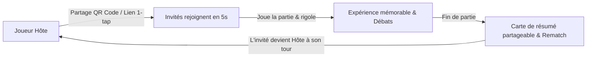

# AgoraX — Stratégie Marketing & Growth

> **Statut du document** : Référentiel Stratégie de Marque, Acquisition & Viralité  
> **Dernière mise à jour** : Septembre 2026  
> **Dépôt officiel** : [https://github.com/danyvassily/agorax.git](https://github.com/danyvassily/agorax.git)

---

## 1. Identité de Marque & Positionnement

### La Proposition de Valeur Unique (UVP)
> **« Le quiz multijoueur instantané qui enflamme vos soirées en 30 secondes. Sans appli à installer, sans compte à créer. »**

### Les 4 Piliers de Différenciation
1. **Friction Zéro Absolue** : Un lien ou un QR code, un pseudo, et la partie commence immédiatement.
2. **Ambiance Bienveillante & Sociale** : Révélation synchrone pour éviter la triche, zéro humiliation du dernier, focus sur le rire et le débat.
3. **Double Moteur Quiz + Débats** : Des questions de culture générale piquantes combinées à des dilemmes insolubles qui font parler le groupe.
4. **Mobile-First & Écran Soirée** : Optimisé pour smartphone au creux de la main, ou projetable sur grand écran en mode TV.

---

## 2. Cibles & Personas Prioritaires

| Persona | Contexte d'Usage | Déclencheur / Moment de Vie | Friction à Éliminer |
| :--- | :--- | :--- | :--- |
| **Maxime, 22 ans (Étudiant)** | Soirée appart, before, BDE, pause café | Cherche un jeu pour briser la glace rapidement entre potes | Hors de question de faire télécharger une appli de 150 Mo à 8 personnes |
| **Sarah, 29 ans (Jeune active)** | Afterwork, pause déj au bureau, apéro | Veut défier ses collègues sans prise de tête | Règles trop longues ou inscription obligatoire |
| **Lucas, 25 ans (Barman / Organisateur)** | Bar à jeux, pub quiz, soirée trivia | Veut animer un groupe de 20 personnes sans régie technique | Latence réseau et complexité de mise en place |

---

## 3. La Boucle Virale Naturelle (Growth Loop)

### Mécaniques de Viralité Intégrées
1. **QR Code Géant & Copie 1-Tap** : Présent dès l'écran de salon, affichable en plein écran pour scan direct.
2. **Carte de Résumé Partageable (Post-Match)** : Export d'un visuel percutant (« Qui est le cerveau de la soirée ? ») adapté aux stories Instagram / TikTok / WhatsApp.
3. **Bouton Rematch 1-Tap** : Relance immédiate avec le même groupe sans ressaisir de code.

---

## 4. Stratégie Réseaux Sociaux (TikTok & Instagram Reels)

### Ligne Éditoriale : « 1 Question, 5 Secondes de Panique »
Le compte officiel AgoraX transforme les mécaniques du jeu en contenus ultra-dynamiques de 15 à 30 secondes :
- **Lundi** : *« 4 personnes sur 5 se trompent sur cette question de primaire »* (Piège & Culture G).
- **Mardi** : *« Le Débat Impossible »* (Dilemme moral ou clivant qui enflamme les commentaires).
- **Mercredi** : *« Quiz 5 Secondes : Tu perds dès la première faute »* (Rythme soutenu).
- **Jeudi** : *« Question Micro-Trottoir / Test Réel en Soirée »* (Réactions authentiques).
- **Vendredi** : *« Le duel de la semaine entre potes »* (Promotion du mode multijoueur).
- **Week-end** : *« Best of des réponses les plus drôles »*.

---

## 5. Matrice des Expériences Marketing (Growth Framework)

Chaque opération marketing suit ce protocole de validation strict :

| ID | Hypothèse | Action & Canal | Audience | KPI Principal | Seuil Succès | Décision |
| :--- | :--- | :--- | :--- | :--- | :--- | :--- |
| **EXP-01** | Les vidéos de type « Débat clivant » génèrent 2x plus de partages et clics profil que les quiz classiques | 5 Reels/TikToks Débat vs 5 Reels Quiz pur | 18-25 ans | Clics vers lien bio / Vues | > 2,5 % clics | À tester |
| **EXP-02** | Le QR code grand format affiché sur table de bar génère au moins 10 parties spontanées | Test physique sur 2 bars partenaires avec flyers QR | Clients du bar | Salons créés via UTM QR bar | > 15 salons / soir | À lancer |
| **EXP-03** | La carte de score partageable en story WhatsApp augmente le taux de retour D1 | Intégration du bouton « Partager le verdict » post-game | Joueurs finissant un match | Viral K-Factor | K > 0,25 | En cours |

---

## 6. Funnel d'Acquisition & Télémétrie

1. **Visiteur Unique** : Arrivée sur `/` ou `/play/online?room=...`
2. **Activation Rapide** : Saisie d'un pseudo (mémorisé en local) ou scan direct (< 15s).
3. **Rétention de Session** : Complétion du 1er match (> 85% d'achèvement visé).
4. **Rematch** : Lancement d'une seconde manche en 1 clic (> 45% visé).
5. **Recommandation** : Partage du lien ou invitation d'un ami (> 20% visé).
